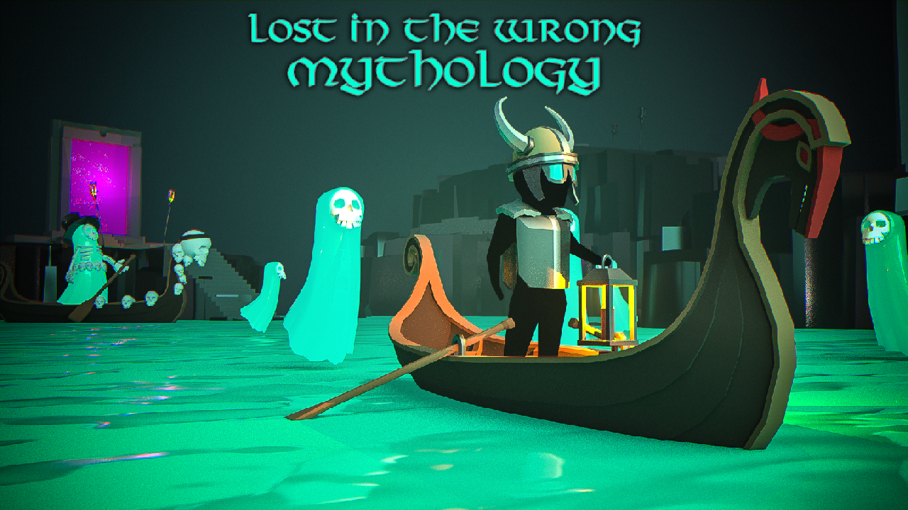

# Lost in the Wrong Mythology

## About the game

You are a Viking expecting to reach the hall of heroes in Valhalla.

But you find yourself lost on the River Styx instead!

Without the fare to pay Charon you must use your ethereal strength to navigate the deadly river in search of the portal to Elysium.

Beware your sanity as you traverse this cursed water, anything can happen!

Lost In The Wrong Mythology was made for Global Game Jam 2021, as part of the Brighton UK local jam.

## Team

Sam Bigos - Code - [Twitter](https://twitter.com/Calneon)
Floyd Billingy - Art - [ArtStation](https://www.artstation.com/floydleroi)
Matt Verkuijlen - Tech Art - [Twitter](https://twitter.com/MattVerkuijlen)

## Project source

This repo contains the full Unity project required to build, modify, and play Lost in the Wrong Mythology. Feel free to play around with it.

## Links

* [Global Game Jam page.](https://globalgamejam.org/2021/games/lost-wrong-mythology-4)
* [Itch.io page.](https://sambigos.itch.io/lost-in-the-wrong-mythology)